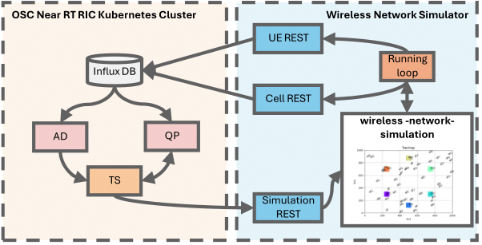

# Testbed Environment: Connecting RIC xApps to a Wireless Network Simulator



## Introduction
Need to add the introduction here.


## Installation, Deployment and Running 
First, need to install the near RT RIC platform from [here](https://docs.o-ran-sc.org/projects/o-ran-sc-ric-plt-ric-dep/en/latest/installation-guides.html#installing-near-realtime-ric-in-ric-cluster)
please **NOTE** to install it with the influxdb 1.x version.

### Install the Near RT RIC platform

```
cd ~/ric-dep/bin
./install -f ../RECIPE_EXAMPLE/example_recipe_oran_f_release.yaml -c "jaegeradapter influxdb"
```
Once the platform is installed, you can check if all pod are running:
```
kubectl get pods -n ricplt
```
should return:
```
NAMESPACE      NAME                                               READY   STATUS             RESTARTS         AGE
kube-flannel   kube-flannel-ds-7d79b                              1/1     Running            0                8h
kube-system    coredns-5dd5756b68-d2gtt                           1/1     Running            0                8h
kube-system    coredns-5dd5756b68-np5pl                           1/1     Running            0                8h
kube-system    etcd-ip-172-31-16-91                               1/1     Running            0                8h
kube-system    kube-apiserver-ip-172-31-16-91                     1/1     Running            0                8h
kube-system    kube-controller-manager-ip-172-31-16-91            1/1     Running            0                8h
kube-system    kube-proxy-sjtrl                                   1/1     Running            0                8h
kube-system    kube-scheduler-ip-172-31-16-91                     1/1     Running            0                8h
ricinfra       nfs-release-1-nfs-server-provisioner-0             1/1     Running            0                7h34m
ricplt         deployment-ricplt-alarmmanager-b79b8b677-l64zs     1/1     Running            0                7h28m
ricplt         deployment-ricplt-e2term-alpha-b565d48bf-cnx75     1/1     Running            0                7h30m
ricplt         deployment-ricplt-jaegeradapter-7489d97555-kdk4x   1/1     Running            0                7h28m
ricplt         deployment-ricplt-o1mediator-859d697d7-rnmwc       1/1     Running            0                7h29m
ricplt         deployment-ricplt-rtmgr-74bf48ff49-92xvh           1/1     Running            1                7h29m
ricplt         deployment-ricplt-submgr-56974f76f6-qngsg          1/1     Running            0                7h29m
ricplt         deployment-ricplt-vespamgr-786666549b-h68qn        1/1     Running            0                7h29m
ricplt         ricplt-influxdb-meta-0                             1/1     Running            0                7h28m
ricplt         statefulset-ricplt-dbaas-server-0                  1/1     Running            0                7h31m

```

install the dms_cli tool to deploy the xApps:
```
sudo -i
docker run --rm -u 0 -it -d -p 8090:8080 -e DEBUG=1 -e STORAGE=local -e STORAGE_LOCAL_ROOTDIR=/charts -v $(pwd)/charts:/charts chartmuseum/chartmuseum:latest
export CHART_REPO_URL=http://0.0.0.0:8090
git clone https://gerrit.o-ran-sc.org/r/ric-plt/appmgr -b h-release
cd appmgr/xapp_orchestrater/dev/xapp_onboarder
apt-get install python3-pip
pip3 uninstall xapp_onboarder
pip3 install ./
chmod 755 /usr/local/bin/dms_cli
ls -la /usr/local/lib/python3.8
chmod -R 755 /usr/local/lib/python3.8
```
you can check if the dms_cli is installed:
```
dms_cli health
```
Now you ready to deploy the simulator and the xApps for the *Traffic Steering* flow:

### Clone the Simulator 
clone the simulator:
```
git clone "this repo"
```

### Deploy the xApps
clone the xApps:
```
sudo -i
git clone https://github.com/Aizikovich/ric-app-ad.git
git clone https://github.com/Aizikovich/ric-app-qp.git
git clone https://github.com/Aizikovich/ric-app-ts.git
```
before building the containers, you need to make sure that the TS xApp configure to the simulator IP address.
you can find the IP address by running:
```
cat /adress-to-simulator/wireless-network-simulator-v2/test.py
```
and see the IP address the Flask server is running on. by default, it should be: `app.run(host='0.0.0.0', port=80)`
you need to change the `ric-app-ts/xapp-descriptor/config-file.json` file to the simulator IP address.
```
vim ~/ric-app-ts/xapp-descriptor/config-file.json
```
and in the "controls" section change the "host" to the simulator IP address.
```
"controls": {
        "ts_control_api": "rest",
        "ts_control_ep": "http://your-ip-address:port/api/echo"
    }
```
Now you are ready to build the containers:
```
cd ~
cd ric-app-ad
docker build -t nexus3.o-ran-sc.org:10002/o-ran-sc/ric-app-ad:1.0.0 .
cd ~

cd ric-app-qp
docker build -t nexus3.o-ran-sc.org:10002/o-ran-sc/ric-app-qp:0.0.5 .
cd ~

cd ric-app-ts
docker build -t nexus3.o-ran-sc.org:10002/o-ran-sc/ric-app-ts:1.2.5 .
cd ~
```
onboard the xApps:
```
dms_cli onboard --config_file_path=ric-app-ad/xapp-descriptor/config.json --shcema_file_path=appmgr/xapp_orchestrater/dev/docs/xapp_onboarder/guide/embedded-schema.json
dms_cli onboard --config_file_path=ric-app-qp/xapp-descriptor/config.json --shcema_file_path=appmgr/xapp_orchestrater/dev/docs/xapp_onboarder/guide/embedded-schema.json
dms_cli onboard --config_file_path=ric-app-ts/xapp-descriptor/config-file.json --shcema_file_path=ric-app-ts/xapp-descriptor/schema.json
```
you can check the charts are onboarded using:
```
dms_cli get_charts_list
```
and get:
```{JSON}
{
    "ad": [
        {
            "apiVersion": "v1",
            "appVersion": "1.0",
            "created": "2025-02-03T19:43:15.804923768Z",
            "description": "Standard xApp Helm Chart",
            "digest": "0eb690525906a31d269b26affc77365c0fbbb18c88d93675ed1a38736cb794b9",
            "name": "ad",
            "urls": [
                "charts/ad-1.0.1.tgz"
            ],
            "version": "1.0.1"
        }
    ],
    "qp": [
        {
            "apiVersion": "v1",
            "appVersion": "1.0",
            "created": "2025-02-03T19:43:16.483247132Z",
            "description": "Standard xApp Helm Chart",
            "digest": "823cde2906ea02148832d0ab83ba974d28a8d0e84528fa71ac04a19b3c498152",
            "name": "qp",
            "urls": [
                "charts/qp-0.0.5.tgz"
            ],
            "version": "0.0.5"
        }
    ],
    "trafficxapp": [
        {
            "apiVersion": "v1",
            "appVersion": "1.0",
            "created": "2025-02-03T19:43:17.19482761Z",
            "description": "Standard xApp Helm Chart",
            "digest": "0a827815b676d22c4e02ee0f14996889fdd17322d66d4fc67dab1989f58a577d",
            "name": "trafficxapp",
            "urls": [
                "charts/trafficxapp-1.2.5.tgz"
            ],
            "version": "1.2.5"
        }
    ]
}

```
Install the xApps:
```
dms_cli install --xapp_chart_name=ad --version=1.0.1 --namespace=ricxapp
dms_cli install --xapp_chart_name=trafficxapp --version=1.2.5 --namespace=ricxapp
dms_cli install --xapp_chart_name=qp --version=0.0.5 --namespace=ricxapp
```
Now you can check if the xApps are running:
```
kubectl get pod -n ricxapp
```
```
NAME                                  READY   STATUS    RESTARTS   AGE
ricxapp-ad-54987d6965-wcxjh           1/1     Running   0          66m
ricxapp-qp-77b8bc77-8q9sj             1/1     Running   0          66m
ricxapp-trafficxapp-7b94b9489-7qx68   1/1     Running   0          66m
```

## Running the simulator
Configure the simulator parameters see the [README](wireless-network-simulator/README.md) file and install the requirements:
```
cd wireless-network-simulator
pip install -r requirements.txt
cd ..
```

When the simulator is configured, you can run the simulator:
```
./run-simulator.sh 
```
Or you can run it manually, see the [README](wireless-network-simulator/README.md) file.
